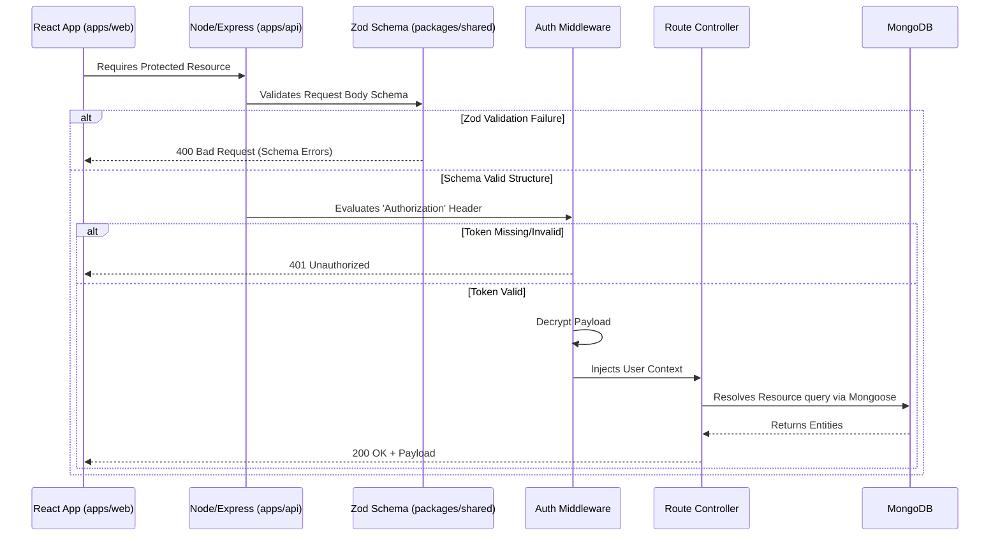

# Backend Architecture

DevPath Tracker utilizes a highly optimized Node.js and Express backend, structured efficiently within a `pnpm` workspace monorepo. This approach enables absolute code sharing and schema synchronization between the backend and frontend modules.

## Core Design Principles

1.  **Monorepo Micro-Packages**: Logic is inherently split. The core web-server resolves within `apps/api`, while strictly validated validation schemas reside globally under `packages/shared`.
2.  **Stateless Sessions**: Authentication utilizes ephemeral memory-held Access Tokens (15m validity), making API horizontal scaling secure and trivial.
3.  **Secure Persistence**: Refresh tokens are isolated into `httpOnly`, `secure` cookies specifically mitigating XSS scraping attacks while allowing session continuity up to 7 days uninterrupted.

## Request Lifecycle Mapping

## Workspace Conventions

The repository natively leverages the pnpm workspace protocols.

### API Module (`apps/api/src/`)
*   `controllers/` - Route endpoint logic handling decoupled Request/Response execution.
*   `middleware/` - Pre-request processors. e.g., Bearer Token decoding context aggregators.
*   `models/` - Mongoose compiled schema files executing final database constraint parsing prior to MongoDB write execution (e.g., `apps/api/src/models/User.ts`).
*   `routes/` - Express Router mappings bridging abstract route strings directly to Controller definitions.
*   `utils/` - Secure shared isolations (e.g., Token signing orchestration, bcrypt salting, Nodemailer email transport logic).

### Shared Module (`packages/shared/src/`)
*   `schema/` - Strictly typed Zod schemas mapping E2E interfaces across network boundaries. Ensures both the client interface and API route enforce mutual structural configurations natively (e.g., `packages/shared/src/schema/authschema.ts`).
