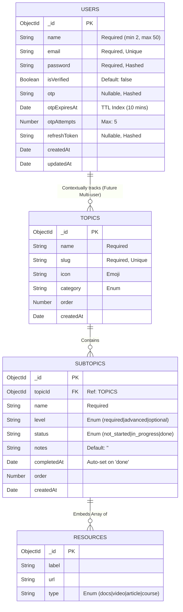

# Database Validation & Schema Design

DevPath Tracker relies on a dual-layer validation strategy. Network request boundaries are strictly enforced via **Zod** (`packages/shared/src/schema`), while the Object Data Modeling (ODM) layer enforces exact persistence constraints via **Mongoose** (`apps/api/src/models`).

## Dual-Layer Validation Flow

1.  **Zod Parsing**: Intercepts requests, guaranteeing inputs like `authschema` exactly match type expectations before the controller processes any underlying logic.
2.  **Mongoose Modeling**: Ensures any database payloads strictly map to the exact `ObjectId` logic requirements and handles asynchronous operations such as pre-saving bcrypt operations.

---

## Entity Relationship Diagram

## Core Collections & Structure

### 1. Users (`apps/api/src/models/User.ts`)
Manages identity securely spanning authentication logic and timed OTP flows. The database utilizes a TTL index mapped against `otpExpiresAt` ensuring invalid tokens are swept implicitly.

**Coupled Zod Schemas:**
- `registerSchema` (defined in `packages/shared/src/schema/authschema.ts`)
- `loginSchema` (defined in `packages/shared/src/schema/authschema.ts`)
- `otpSchema` (defined in `packages/shared/src/schema/authschema.ts`)

### 2. Topics (`apps/api/src/models/Topic.ts`)
Represents the structural bounds defining the 19 core curriculum domains (e.g., React, Node.js, Git). Exists as the ultimate parent aggregator for progress algorithms.

### 3. Subtopics (`apps/api/src/models/Subtopic.ts`)
Granular learning checkpoints strictly related back to a parent Topic utilizing Mongoose's `ref: "Topic"` paradigm. It utilizes Sub-Document embeddings explicitly for associated `Resources` limiting potentially hazardous NoSQL table joins and exponentially accelerating standard read workloads.
