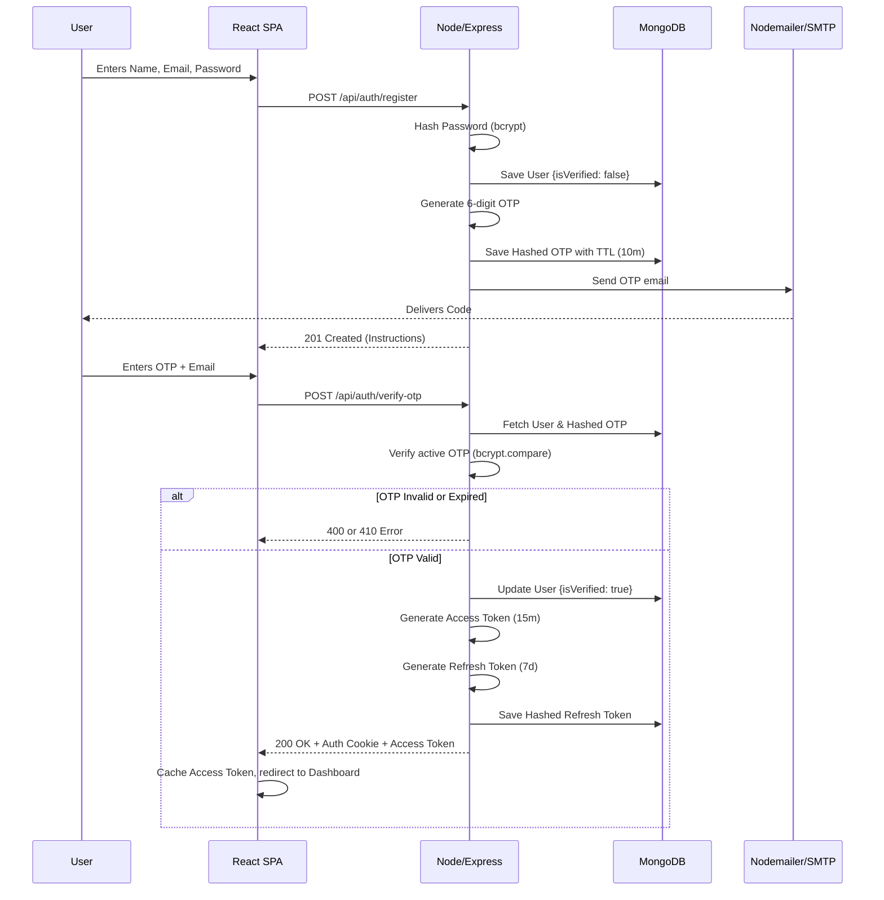
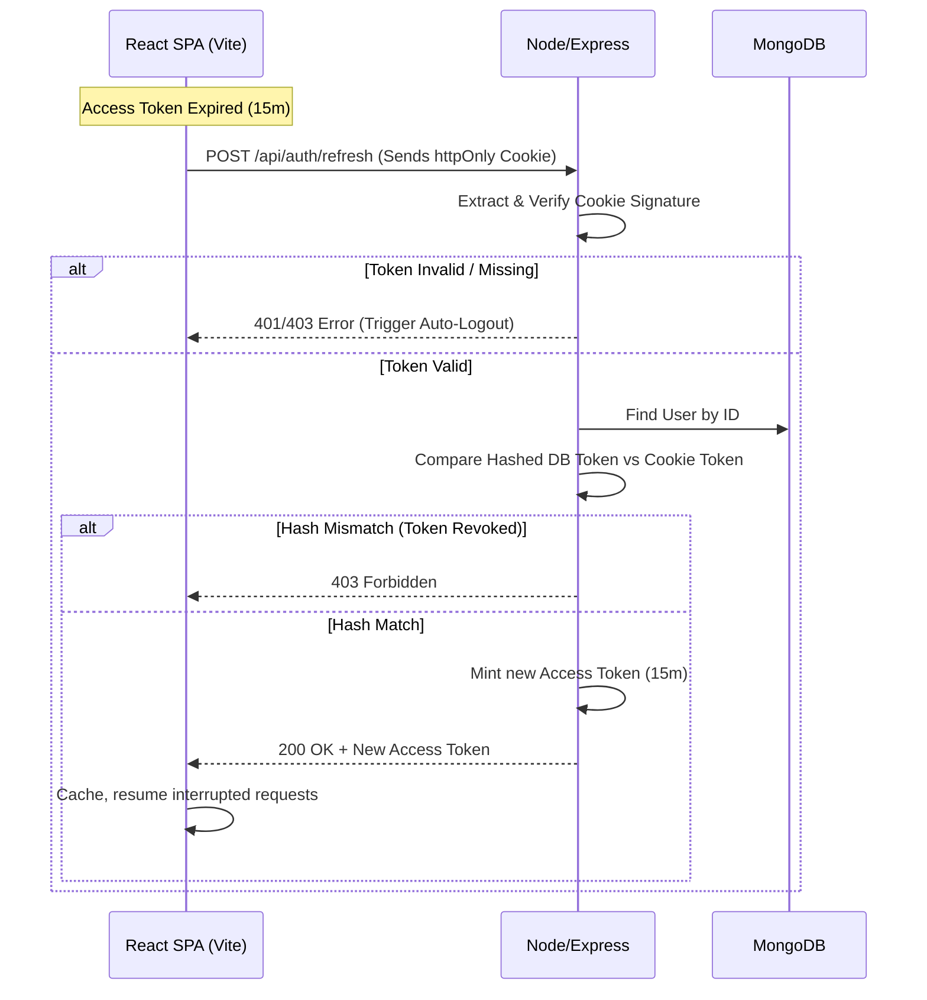

# Authentication Flow Diagram

This document delineates the exact sequence of events that encompass the authentication security strategy of DevPath Tracker.

## Registration & Verification Flow

## Session Hydration (Refresh) Flow

